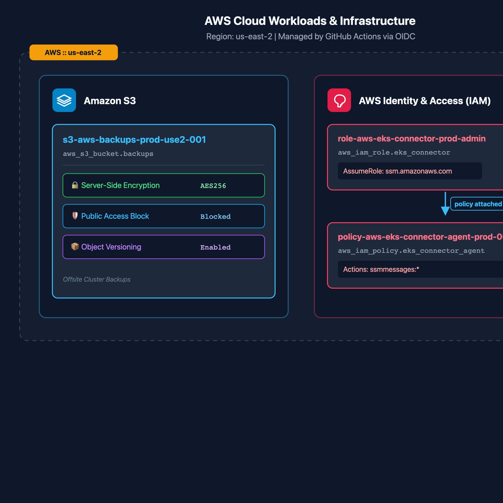
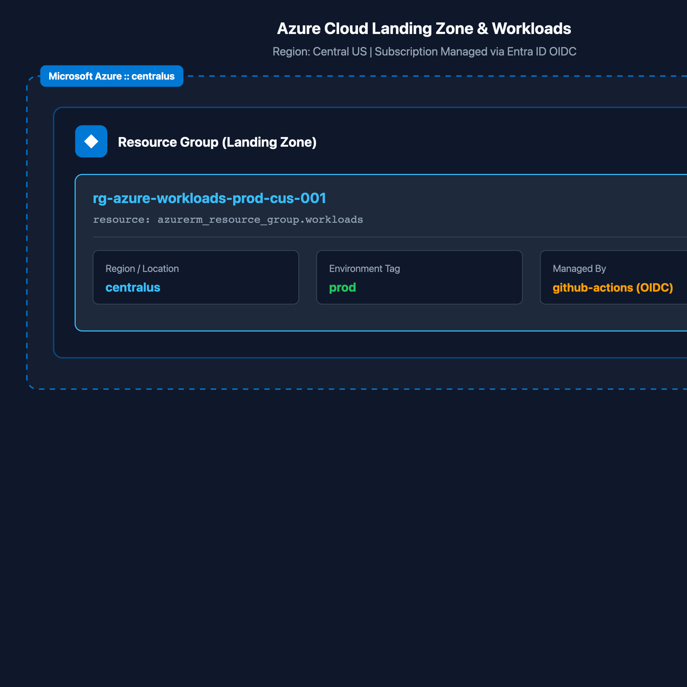
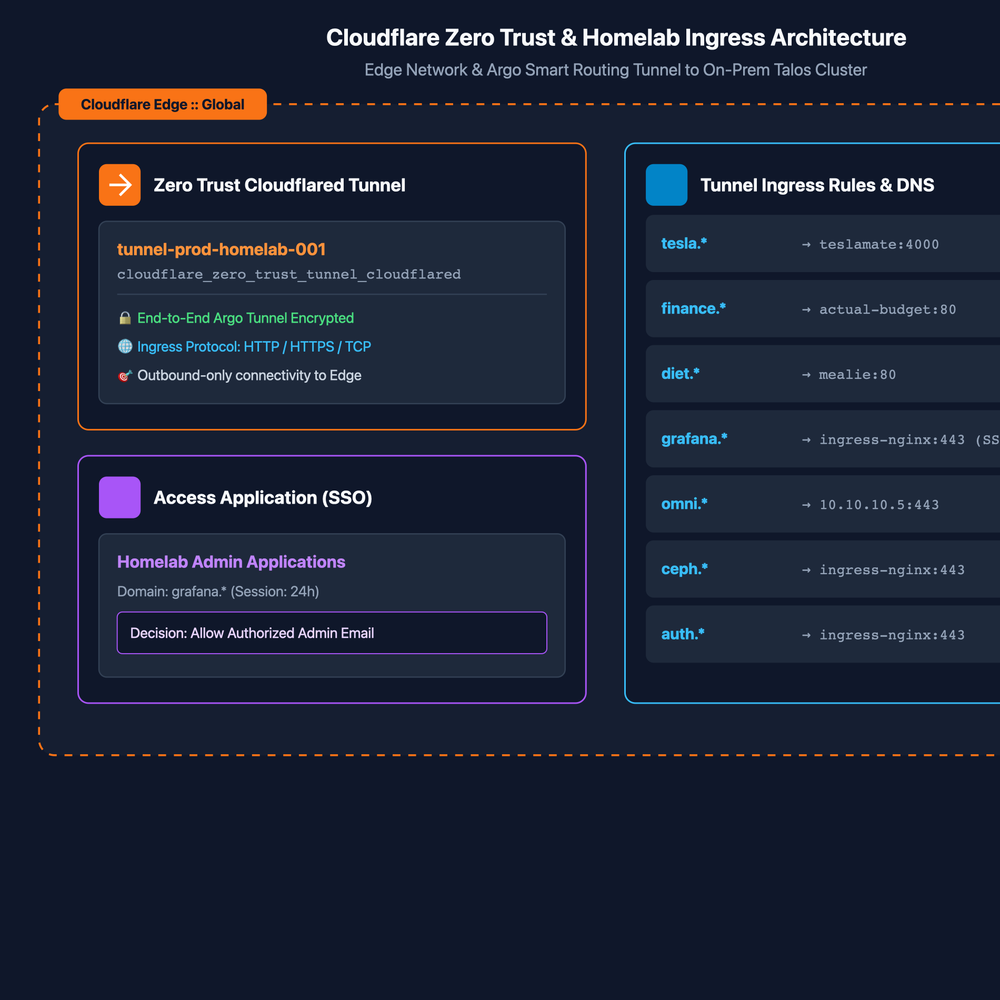

# 🚀 Infrastructure Cloud Deployments (`infra-cloud-deployments`)

This repository serves as the dedicated, automated GitOps deployment engine for hybrid multi-cloud infrastructure (Microsoft Azure, AWS, and Cloudflare), decoupled from local workstations and the architecture documentation vault.

---

## 🔒 Security Architecture: Zero-Trust OIDC Federation

This repository operates strictly on **OpenID Connect (OIDC) Workload Identity Federation**:

1. **Zero Static Credentials**: No `ARM_CLIENT_SECRET`, AWS Access Keys, or permanent passwords are saved in GitHub Secrets.
2. **Ephemeral Identity Minting (Azure)**:
   * Each workflow job requests a cryptographic JSON Web Token (JWT) directly from `token.actions.githubusercontent.com`.
   * Microsoft Entra ID validates the signature and subject claim (`repo:bar2sek/infra-cloud-deployments:environment:production`).
   * Entra ID mints a short-lived OAuth access token scoped strictly to the authorized permissions of `sp-azure-github-actions-prod-001`.
3. **Ephemeral Identity Minting (AWS)**:
   * The same GitHub-issued JWT is exchanged with AWS STS via `aws-actions/configure-aws-credentials`.
   * AWS validates the token against the GitHub OIDC identity provider and assumes the role referenced by the `AWS_ROLE_TO_ASSUME` secret, returning temporary STS credentials.
4. **Auditability & Traceability**:
   * Every Azure resource modification links directly to the specific GitHub Actions execution, pull request ID, and Git commit hash in Azure Activity Logs.
   * AWS resources carry `default_tags` (`Environment`, `ManagedBy = github-actions`, `Repository`) so every object traces back to this pipeline, with API-level attribution in CloudTrail.

---

## 📁 Repository Structure

```
.
├── .github/
│   └── workflows/
│       ├── azure-deploy.yml        # Azure CI/CD pipeline (Lint, Plan, Apply)
│       ├── aws-deploy.yml          # AWS CI/CD pipeline (Lint, Plan, Apply)
│       └── cloudflare-deploy.yml   # Cloudflare CI/CD pipeline (Lint, Plan, Apply)
├── terraform/
│   ├── azure/                      # Azure cloud infrastructure & workloads
│   │   ├── providers.tf            # Azure provider & AzureRM remote state backend
│   │   ├── main.tf                 # Cloud resources & network landing zones
│   │   ├── variables.tf            # Input variable definitions
│   │   └── outputs.tf              # Resource outputs
│   ├── aws/                        # AWS cloud infrastructure & workloads
│   │   ├── providers.tf            # AWS provider, S3 backend & native S3 lockfile
│   │   ├── locals.tf               # Canonical resource naming convention
│   │   ├── main.tf                 # S3 backup bucket (+ lifecycle) & EKS connector IAM role
│   │   ├── bedrock-kb.tf           # Bedrock Knowledge Base on S3 Vectors (RAG)
│   │   ├── kb-corpus/              # Synthetic policy handbook, synced to S3 by CI after apply
│   │   ├── variables.tf            # Input variable definitions
│   │   ├── outputs.tf              # Resource outputs
│   │   └── .terraform.lock.hcl     # Pinned provider checksums (tracked)
│   └── cloudflare/                 # Cloudflare Zero Trust Tunnels, DNS & Access SSO
│       ├── providers.tf            # Cloudflare provider & S3 backend with native S3 locking
│       ├── locals.tf               # Tunnel naming convention
│       ├── main.tf                 # Zero Trust Tunnels, Ingress routing, DNS, Access SSO
│       ├── variables.tf            # Input variable definitions
│       ├── outputs.tf              # Tunnel ID & token outputs
│       └── .terraform.lock.hcl     # Pinned provider checksums (tracked)
├── docs/                           # Automated architecture diagrams & documentation
│   ├── bedrock-knowledge-base.md   # Bedrock KB design, IAM layering, test & troubleshooting runbook
│   ├── architecture-aws.svg        # Auto-generated AWS topology
│   ├── architecture-azure.svg      # Auto-generated Azure topology
│   └── architecture-cloudflare.svg # Auto-generated Cloudflare topology
└── README.md
```

> [!NOTE] Resource Naming Convention
> AWS resources are composed in `terraform/aws/locals.tf` following `<abbrev>-aws-<product>-<env>-<region-code>-<iteration>` (e.g. `s3-aws-backups-prod-use2-001`). IAM roles follow `role-aws-<purpose>-<env>-admin`. Extend the `locals` block rather than hardcoding names inline.

> [!WARNING] Local Provider Cache
> Running `terraform init` locally materializes `.terraform/` directories containing provider binaries that can exceed **600 MB per provider**. These are gitignored, but if this repository is cloned inside a cloud-synced folder, clear them after local plan sessions:
> ```bash
> rm -rf terraform/*/.terraform
> ```

---

## 🗺️ Live Cloud Architecture & Topology

These topology diagrams are **generated on every plan and deployment** by GitHub Actions using [Inframap](https://github.com/cycloidio/inframap) (version- and checksum-pinned) and Graphviz, and published as a downloadable **workflow artifact**.

> [!NOTE]
> CI never commits to `main`. Branch protection applies to everyone, including admins and the CI bot, and the apply jobs hold production cloud credentials with a read-only repository token. To refresh the diagrams committed here, download the artifact from the latest run and include it in a pull request.

### 1. Amazon Web Services (AWS)

*Vector source:* [`docs/architecture-aws.svg`](docs/architecture-aws.svg)

**Amazon Bedrock Knowledge Base** — managed RAG over a synthetic policy handbook, stored in S3 Vectors, deployed and ingested entirely by this pipeline. Design, IAM layering, and test commands: [docs/bedrock-knowledge-base.md](docs/bedrock-knowledge-base.md).

### 2. Microsoft Azure

*Vector source:* [`docs/architecture-azure.svg`](docs/architecture-azure.svg)

### 3. Cloudflare Zero Trust & Ingress Routing

*Vector source:* [`docs/architecture-cloudflare.svg`](docs/architecture-cloudflare.svg)


---

## 🚦 Deployment Lifecycle & Protection Gates

All deployment pipelines (`azure-deploy.yml`, `aws-deploy.yml`, and `cloudflare-deploy.yml`) follow an identical two-stage gate:

* **Pull Request (`pull_request`)**:
  * Runs `terraform fmt -check`, `terraform init`, and `terraform validate`.
  * Runs a speculative `terraform plan` and outputs the planned changes into the PR review summary.
  * State remains unmutated (read-only execution).
* **Merge to Main (`push`)**:
  * Triggers the `production` GitHub Environment.
  * Respects environment protection rules (manual approval gates, required branch policies).
  * Executes `terraform apply -auto-approve` to deploy changes.
  * Automatically records deployment history in GitHub Deployments dashboard.

> [!IMPORTANT]
> Never bypass the PR plan gate by pushing directly to `main`. The speculative plan is the only review surface between a code change and a mutated cloud resource.

---

## 🗄️ Remote State Backends

State is **never** stored locally or committed to Git.

| Plane | Backend | Locking |
| :--- | :--- | :--- |
| AWS (`terraform/aws/`) | S3 bucket, server-side encrypted, key `aws-workloads/terraform.tfstate` (`us-east-2`) | **Native S3 lockfile** (`use_lockfile = true`) |
| Azure (`terraform/azure/`) | AzureRM Blob Storage container | Native blob lease |
| Cloudflare (`terraform/cloudflare/`) | S3 bucket, server-side encrypted, key `cloudflare-workloads/terraform.tfstate` (`us-east-2`) | **Native S3 lockfile** (`use_lockfile = true`) |

---

## 📌 Provider Versions & Upgrades

`providers.tf` sets the allowed range; the committed `.terraform.lock.hcl` pins the **exact** version and its checksums, so CI and laptops always run the same provider binary.

| Plane | Constraint | Why |
| :--- | :--- | :--- |
| AWS | `~> 6.27` | 6.27.0 added S3 Vectors storage for Bedrock Knowledge Bases |

**Major-version upgrades ship alone**, in their own PR, before any feature that needs them. The PR plan must show `No changes`; if a later feature PR misbehaves, the upgrade is already ruled out.

```bash
cd terraform/aws
export TF_DATA_DIR=/tmp/tfdata-aws          # keep provider binaries out of the synced vault
eval "$(aws configure export-credentials --format env)"
terraform init -upgrade -backend-config=backend.hcl
# Record checksums for BOTH the macOS laptop and the Linux CI runners; a lock
# file with only one platform's hashes fails `terraform init` on the other.
terraform providers lock -platform=darwin_arm64 -platform=linux_amd64
terraform plan -lock=false                  # expect: No changes
```

---

## ⚙️ Declarative Governance

This repository, its `production` environment, branch protection policies, and its Actions configuration are managed declaratively via Terraform from the `bootstrap/github/` module in the `personal-technology` repository.

Values are published at **two scopes**, because GitHub resolves lookups with precedence `environment > repository > organization`:

* **Repository scope** — the shared baseline. This is what the PR `plan` job reads; that job deliberately declares no `environment:`, since adding one would subject every pull request to the production approval gate.
* **Environment scope** — `production` overrides, and the extension point for future `staging`/`dev` environments.

| Name | Kind | Why |
| :--- | :--- | :--- |
| `AZURE_CLIENT_ID` | Variable | Identifier, not a credential — useless without a matching federated credential |
| `AZURE_TENANT_ID` | Variable | As above |
| `AZURE_SUBSCRIPTION_ID` | Variable | As above |
| `AWS_ROLE_TO_ASSUME` | **Secret** | An ARN grants nothing on its own, but it embeds the AWS account ID, and Actions prints step inputs verbatim into the public logs |
| `AWS_REGION` | Variable | Non-sensitive |
| `AWS_TF_STATE_BUCKET` | **Secret** | Embeds the AWS account ID and is interpolated into a `run:` command, which Actions echoes verbatim into logs. A secret is masked to `***`; a variable is not. |
| `CLOUDFLARE_DESTINATION_EMAIL` | **Secret** | Personal email address (PII) |

> [!NOTE]
> Under OIDC there is no static credential to protect, so access is not the deciding factor. **Log exposure is:** this repository's Actions logs are public, and Actions prints step inputs and `run:` commands with values expanded. Anything that embeds the AWS account ID or personal data is a secret; other identifiers stay variables, which keeps them readable and lets Terraform detect drift (`github_actions_secret` is write-only, so Terraform tracks a hash and cannot see out-of-band edits made in the GitHub UI).
>
> As a second layer, both AWS credential steps set `mask-aws-account-id: true`, which masks the account ID in any later output, such as ARNs in Terraform plans and AWS error messages.

---

## 🧭 Repository Boundary

This repository is the cloud **execution plane**. Keep the split clean:

| Belongs here | Belongs in `personal-technology` |
| :--- | :--- |
| AWS / Azure / Cloudflare resources deployed by CI/CD | On-prem Talos, Kubernetes, Ceph, KubeVirt manifests |
| Pipeline-owned remote state and OIDC trust policies | UniFi network provisioning, Ansible playbooks |
| Cloud landing zones and IAM | `nix-mac` workstation state, GitHub governance modules |

Never define the same resource in both repositories—ownership follows whichever plane controls its lifecycle.

> [!IMPORTANT]
> **Guardrail exception: the backup bucket.** `terraform/aws/main.tf` owns the bucket, versioning, encryption, public-access block, and lifecycle. Its **guardrails** are owned by `personal-technology/bootstrap/aws` (applied only by an administrator): the bucket policy (TLS only, `*.age` objects only, no governance bypass), S3 Object Lock (governance, 30 days), and the write-only uploader identity. The CI apply role carries an explicit Deny on changing them. This is deliberate: a pipeline must not control the guardrails that protect against it. Do not add `aws_s3_bucket_policy` or `aws_s3_bucket_object_lock_configuration` for this bucket here. The apply would fail with `AccessDenied` anyway.
