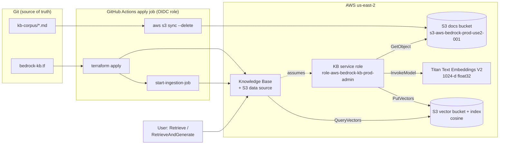
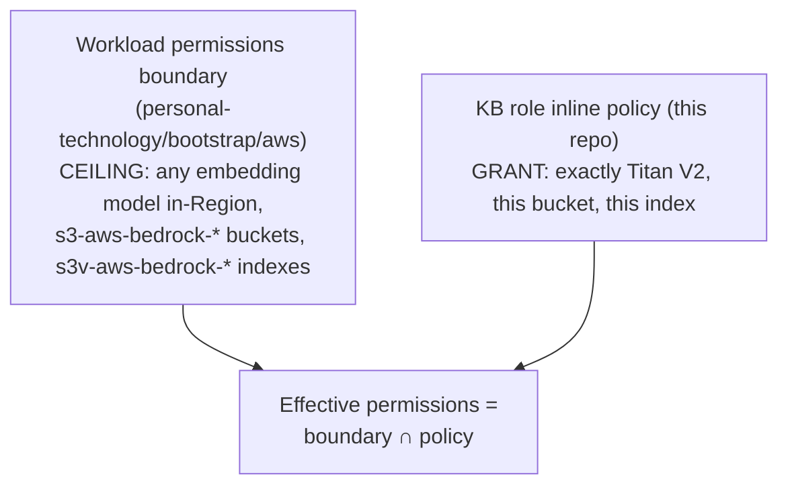

# 🧠 Amazon Bedrock Knowledge Base on S3 Vectors

> [!abstract] What this is
> A managed **retrieval-augmented generation (RAG)** pipeline, built entirely with Terraform and GitHub Actions. A synthetic company policy handbook (`terraform/aws/kb-corpus/`) is embedded with **Amazon Titan Text Embeddings V2**, stored in an **Amazon S3 Vectors** index, and queried through a **Bedrock Knowledge Base**. Answers come back grounded in those documents, with citations.
>
> Every component is created by the CI apply role under OIDC, and every IAM role is capped by a permissions boundary. There are no static credentials and no console click-ops.

---

## 🗺️ Architecture



| # | Resource | Purpose |
| :--- | :--- | :--- |
| 1 | `aws_s3_bucket.bedrock_docs` (+ SSE-S3, public access block) | Holds the source documents |
| 2 | `aws_s3vectors_vector_bucket.bedrock` | Vector storage container (SSE-S3) |
| 3 | `aws_s3vectors_index.bedrock_kb` | 1024-dimension cosine index; Bedrock's text and metadata keys non-filterable |
| 4 | `aws_iam_role.bedrock_kb` + inline policy | Identity Bedrock uses during ingestion and retrieval |
| 5 | `time_sleep.bedrock_kb_role_propagation` | 20 s wait for IAM eventual consistency |
| 6 | `aws_bedrockagent_knowledge_base.company_handbook` | Ties the embedding model to the vector store |
| 7 | `aws_bedrockagent_data_source.company_handbook` | Points the KB at the docs bucket; fixed 300-token chunks, 20% overlap |

---

## 🧭 Design Decisions

### Why S3 Vectors
S3 Vectors has **no idle cost**: you pay per GB stored and per query. OpenSearch Serverless, the console's default, has a capacity-unit floor of hundreds of dollars a month even when unused. For a low-query internal knowledge base, S3 Vectors is the right trade.

The trade-offs:
- semantic search only, with no hybrid keyword search;
- sub-second rather than millisecond latency;
- float32 embeddings only.

### Why the corpus is synced by CI, not managed by Terraform
Managing documents as `aws_s3_object` resources would make every `terraform plan` re-read each object. The PR plan role is **denied** object reads outside the state bucket, so that this pipeline can never be used to read data. Rather than weaken that rule, the apply job mirrors `kb-corpus/` with `aws s3 sync --delete` and then starts an ingestion job.

Git stays the single source of truth, and document changes are still reviewed in the PR diff.

### Why ingestion is a pipeline step
Ingestion is an *action* (parse, chunk, embed, write vectors), not a resource, so Terraform has nothing to model. The job is **incremental**: only new, changed, or deleted files are reprocessed, so running it on every apply is cheap.

### Chunking
Fixed-size chunks of **300 tokens with 20% overlap**. The source documents are short and topic-dense, so small chunks keep each vector about one subject. The overlap means a fact near a boundary appears whole in at least one chunk.

### Immutable choices
These force replacement, plus a full re-ingestion, if changed:

- the vector index **dimension** (it must equal the embedding model's output: Titan V2 at 1024);
- the vector bucket's **encryption type**;
- the KB's **embedding model**.

---

## 🔐 IAM: Three Layers



1. **The CI apply role** (owned by `personal-technology/bootstrap/aws`) can create Bedrock resources, and can pass **only** `role-aws-bedrock-*` roles, **only** to `bedrock.amazonaws.com`.
2. **The workload boundary** caps any role CI creates. Even if this repo's policy were edited to grant `s3:GetObject` on `*`, the KB role still could not read the state or backup buckets.
3. **The KB role's own policy** grants exact ARNs only.

**The trust policy** lets only Bedrock assume the role, and only on behalf of a knowledge base in this account and Region (`aws:SourceAccount` + `aws:SourceArn`). This prevents the *confused deputy* problem, where another account's Bedrock resource tricks the service into using your role.

---

## 🧪 Testing the Knowledge Base

Run these locally after the apply job succeeds. Sign in first with `aws login` (or `aws login --remote` to approve on another device).

```bash
KB_ID=$(aws bedrock-agent list-knowledge-bases --region us-east-2 \
  --query "knowledgeBaseSummaries[?starts_with(name,'kb-aws-company-handbook')].knowledgeBaseId" --output text)
```

**1. Retrieval only.** This returns the matching chunks and their relevance scores, with no language model involved:

```bash
aws bedrock-agent-runtime retrieve --region us-east-2 \
  --knowledge-base-id "$KB_ID" \
  --retrieval-query text="How long do I have to submit an expense report?" \
  --query 'retrievalResults[].{score:score,source:location.s3Location.uri,text:content.text}' --output json
```

Expected: the top result comes from `expense-policy.md` and contains "within **30 calendar days**".

**2. Retrieval plus a generated answer**, using Amazon Nova Lite through the US cross-Region inference profile:

```bash
ACCT=$(aws sts get-caller-identity --query Account --output text)
aws bedrock-agent-runtime retrieve-and-generate --region us-east-2 \
  --input text="Can I work from another country, and for how long?" \
  --retrieve-and-generate-configuration "{\"type\":\"KNOWLEDGE_BASE\",\"knowledgeBaseConfiguration\":{\"knowledgeBaseId\":\"$KB_ID\",\"modelArn\":\"arn:aws:bedrock:us-east-2:$ACCT:inference-profile/us.amazon.nova-lite-v1:0\"}}" \
  --query '{answer:output.text,sources:citations[].retrievedReferences[].location.s3Location.uri}'
```

Expected: up to 20 working days in a 12-month period with manager approval, citing `remote-work-policy.md`.

**3. A question the corpus can't answer**, for example "What is the dress code?". A well-grounded RAG system should say it doesn't know rather than invent a policy. Milestone 4 (Guardrails) adds **contextual grounding checks** to enforce this.

---

## 💰 Cost

| Item | Basis | Lab scale |
| :--- | :--- | :--- |
| S3 Vectors storage | Per GB-month | A few KB, effectively $0 |
| S3 Vectors queries | Per query and data scanned | Fractions of a cent |
| Titan V2 embeddings | Per 1K input tokens | One-time, under a cent for this corpus; only changed files are re-embedded |
| Nova Lite generation | Per input/output token | Fractions of a cent per question |
| Knowledge Base itself | No hourly charge | $0 idle |

---

## 🛠️ Troubleshooting

| Symptom | Cause | Fix |
| :--- | :--- | :--- |
| `AccessDenied ... iam:PassRole` during apply | KB role name outside `role-aws-bedrock-*` | Keep the naming in `locals.tf`; don't widen PassRole |
| `CreateKnowledgeBase`: role "cannot be assumed" or validation error | IAM propagation lag | Re-run the job; increase `time_sleep` if it recurs |
| Ingestion `FAILED` with AccessDenied | The KB role hit the **boundary**: bucket or index name doesn't match `s3-aws-bedrock-*` / `s3v-aws-bedrock-*` | Fix the names; check `failureReasons` in the job log |
| Ingestion fails on metadata size | Filterable metadata over the per-vector limit | Keep `AMAZON_BEDROCK_TEXT` and `AMAZON_BEDROCK_METADATA` non-filterable; avoid hierarchical chunking with large parent chunks |
| `$(terraform output -raw …)` returns garbage in CI | `setup-terraform` wrapper echoes extra lines | `terraform_wrapper: false` on the apply job (already set) |
| Retrieve returns nothing | Ingestion hasn't run, or ran before the files were synced | Check the "Sync Bedrock Knowledge Base Corpus & Ingest" step's statistics table |

> [!WARNING] Tear-down is a human action
> The CI apply role has no `s3vectors:DeleteVectorBucket` and no `s3:DeleteBucket`. Removing this stack from Terraform will delete the KB, data source, and index, then **fail** on the buckets by design. Empty and delete them as `admin-cli`.
